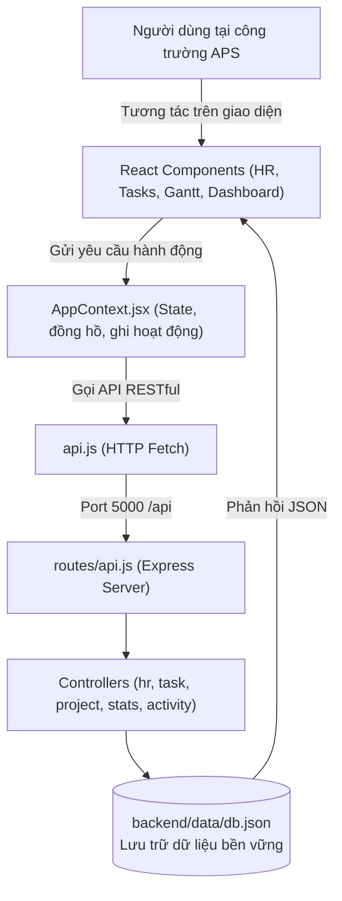

# TÀI LIỆU KIẾN TRÚC MÃ NGUỒN (ARCHITECTURE GUIDE)

## Cố định thanh điều khiển HR, Công việc, Nhật ký — 09/10/2026

- Áp dụng thêm cho `workload` (Quản lý nhân sự): header đứng yên, nhóm Ngày/Tháng/Năm, chọn kỳ, tìm kiếm/phân công và thống kê sticky ở đầu vùng cuộn main; bảng phân bổ bên dưới vẫn cuộn ngang/dọc như trước.
- `MainLayout` bật `app-fixed-controls` và khóa cuộn document chỉ cho `hr`, `tasks`, `activity`. Khung có chiều cao `100dvh`; header không co và nằm ngoài vùng cuộn `main`. Các trang khác giữ cách cuộn cũ. Đổi trang reset vùng cuộn thông qua key của main.
- Nhóm KPI/tìm kiếm/bộ lọc của HR và thanh chọn mục/tìm kiếm của Công việc sticky ở `top: 0` trong main, ngay dưới header; chỉ nội dung danh sách cuộn. Dùng chiều cao thực của nhóm điều khiển để hỗ trợ khi các ô xuống dòng trên màn hình hẹp.
- Nhật ký dùng flex trong chiều cao còn lại: toolbar, phần Lịch sử cập nhật dữ liệu và phân trang đứng yên; vùng bảng cuộn riêng, tiêu đề cột sticky `top: 0`. Không đổi logic bộ lọc, thao tác hay dữ liệu.
- Cột nội dung tạo stacking context riêng để header luôn trên danh sách nhưng không đè lên sidebar di động; modal vẫn portal vào body.

## Phân công trùng ngày nghỉ — 09/10/2026

- Khi lưu trong bảng Người đảm nhận công việc, kiểm tra toàn bộ khoảng ngày của từng người bằng `utils/assignmentCalendar.js`. Nếu trùng ngày lễ hoặc Chủ nhật, `AssignmentCalendarConfirmation` liệt kê ngày và hỏi CÓ/Không; không trùng thì lưu trực tiếp. X đóng cảnh báo và giữ form, chưa lưu.
- CÓ lưu `excludeNonWorkingDays: false`, giữ lịch ngày thường. Không lưu `true` trên từng assignment, bỏ ngày lễ/Chủ nhật; thứ Bảy không tự loại. Khoảng chỉ gồm ngày nghỉ bị từ chối nếu chọn Không, để người dùng sửa ngày hoặc chọn Có. Dữ liệu cũ chưa có lựa chọn không tự bị thay đổi.
- `assignmentCalendar.js` dùng chung lịch Việt Nam và được backend nhập từ cây frontend để tránh hai bộ lịch khác nhau; cần triển khai đầy đủ cây mã nguồn. DB chuẩn hóa `calendarAdjusted`, `days`/`estimatedDays` và `estimatedHours` khi đọc/ghi, kể cả sau khi đổi ngày, chuyển năm hay mở lại. Giữ ngày bắt đầu/kết thúc là khoảng bao ngoài; số ngày làm là hợp các ngày làm của nhân sự, giờ công cộng theo từng phân công.
- `GanttExcludedDaysBar` tách thanh tại ngày không ai làm; tiến độ tô theo số ngày làm thay vì chiều dài khoảng bao ngoài. Nếu một người khác vẫn chọn làm ngày nghỉ đó thì thanh chung vẫn hiện ngày đó. Nhãn từng người và tổng công dùng cùng bộ lọc ngày. Ví dụ 23–25/11/2026 ở 8h/ngày: CÓ = 3 ngày/24h; Không = 2 ngày/16h và trống ngày 24.
- Danh sách task theo ngày của HR, kiểm tra chọn task ở backend và bảng phân bổ giờ đều tôn trọng lựa chọn đã lưu. Tiến độ giữ phép tính giờ đã làm / giờ dự kiến, với mẫu số đã bỏ giờ ngày nghỉ; không thay đổi dữ liệu chấm công lịch sử.
- Kiểm thử `backend/tests/assignment-calendar.test.js`, ca ngày nghỉ trong `hr-shifts.test.js`, và `/tests/assignment-calendar.html` kiểm tra cảnh báo, hai lựa chọn, lưu/nạp, lịch tương lai, khoảng trống Gantt và tiến độ.

## Mã nhân viên tự động — 09/10/2026

- `backend/src/utils/employeeCodes.js` cấp mã NV theo bộ đếm `employeeCodeSequence` lưu trong DB, không theo số lượng nhân viên hiện có. Xóa người không giảm bộ đếm; phía client không tự đặt mã. Người mới có `createdAt` để xác định thứ tự tạo.
- `models/db.js` sửa mã trùng/thiếu khi đọc và ghi dữ liệu, gồm dữ liệu seed; giữ mã hợp lệ và ID liên kết task. Khi mã trùng, ưu tiên người tạo trước theo timestamp hoặc thứ tự lưu cũ nếu không có timestamp. Không đánh lại toàn bộ mã sau khi xóa nhân sự.
- Kiểm thử: `backend/tests/employee-codes.test.js` kiểm tra tạo liên tiếp, xóa hết rồi nạp lại, sửa mã trùng, dữ liệu cũ, mã vượt 999 và API bỏ qua mã do client gửi.

## Menu Gantt và ghi chú dài — 09/10/2026

- Menu ba chấm của mục công việc dùng `components/ViewportMenu.jsx`, portal vào body, đo chiều cao thực để mở lên/xuống, giữ trong mép màn hình và cuộn nội bộ khi thiếu chỗ. Vị trí cập nhật khi cuộn/resize; click ngoài và Escape vẫn đóng menu, các thao tác giữ nguyên.
- `GanttEditableWorkCell` dùng textarea cho `ganttNote`, không đặt maxlength, tự ngắt cả chuỗi dài và cuộn để đọc toàn bộ nội dung. Enter xuống dòng, Ctrl+Enter hoặc rời ô lưu. Nút mở rộng/nhấp đúp mở khung soạn lớn với bản nháp riêng, Hủy và Lưu ghi chú; lỗi lưu giữ khung và nội dung để thử lại. Dùng chung cho mục và task hiện tại/tạo mới; trường công hợp đồng giữ input số.

## Màu lịch Gantt — 09/10/2026

- Bảng phân bổ giờ ở chế độ Ngày và Tháng (`modules/workload/WorkloadPage.jsx`) dùng chung `vietnamCalendarDay` để tô vàng cả tiêu đề và các ô của cột ngày lễ; tooltip có tên lễ. Ở chế độ Ngày, cột “Phân bổ trong ngày” đổi màu theo ngày đang chọn. Đổi ngày/tháng/năm tự tính lại; chỉ đổi hiển thị, giữ nguyên định mức và số giờ phân bổ.
- `frontend/src/utils/vietnamCalendar.js` tính thứ Bảy, Chủ nhật và ngày lễ theo từng ngày của timeline, qua cả ranh giới năm và năm nhuận. Âm lịch dùng công thức thiên văn với UTC+7, loại tháng nhuận khi xác định Giỗ Tổ/Tết; không dùng lịch Trung Quốc thay cho lịch Việt Nam.
- Ngày lễ vàng, Chủ nhật nâu nhạt, thứ Bảy be nhạt; ngày lễ ưu tiên khi trùng cuối tuần. Header ngày và nền SVG dùng chung dữ liệu. `GanttCalendarBackground` vẽ trước lưới, đường liên kết, thanh và tên Gantt, với `pointerEvents="none"`; không đổi ngày làm, lịch task hay phép tính công.
- Lịch năm 2026 theo [9441/TB-BNV](https://moha.gov.vn/tin-tuc/---oid57695); lịch Tết/Quốc khánh năm 2027 theo [10065/VPCP-KGVX](https://xaydungchinhsach.chinhphu.vn/de-xuat-2-phuong-an-nghi-tet-nguyen-dan-2027-tet-dinh-mui-11926080513033257.htm). Ngày Văn hóa 24/11 áp dụng từ 2026 theo [28/2026/QH16](https://vanban.chinhphu.vn/?docid=218008&pageid=27160). Đây là lịch tham chiếu đã công bố cho khối hành chính, không thiết lập lịch nghỉ riêng của doanh nghiệp.
- Các năm chưa có cấu hình vẫn tự tính ngày lễ dương lịch, Giỗ Tổ và mùng 1–5 Tết; tooltip Tết ghi rõ chờ lịch nghỉ hằng năm. Ngày nghỉ liền kề Quốc khánh, hoán đổi và nghỉ bù không được suy đoán sang năm khác. Khi có thông báo mới, cập nhật `annualSchedules` và kiểm thử; ứng dụng không có dịch vụ tự tải thông báo lịch nghỉ tương lai.

## Đồng bộ chi tiết dự án với Gantt — 09/10/2026

- Bảng phòng ban có thẻ nhóm, biểu tượng, số nhân sự, nhãn task/OT/công và hàng nhân sự phân cấp; giữ nguyên phép tổng hợp và thao tác mở/đóng. Biểu đồ **Task lớn theo hạng mục** lấy tên giai đoạn hiện tại qua `utils/ganttPhase.js`, đi theo ID Gantt và chuỗi nhóm cha (kể cả task con), không dùng `task.phase` cũ nếu đã xác định được nhóm Gantt. Đổi tên giai đoạn hoặc tạo nhóm/task mới tự phản ánh khi state cập nhật. `utils/ganttHierarchy.js` là hàm phân cấp dùng chung với Gantt, giữ hỗ trợ WBS cũ và giới hạn trong đúng dự án.

- Bảng **Nhân sự & giờ công** dùng `ProjectDepartmentList.jsx` để nhóm theo trường `team` hiện tại của nhân sự, có nút mở/đóng từng phòng ban. Dòng phòng ban hiển thị số task duy nhất và tổng Công TT của các thành viên; dòng nhân sự hiển thị số task duy nhất, giờ OT đã duyệt và Công TT (= giờ phân công Gantt ÷ 8). Task giao cho nhiều người cùng phòng chỉ tính một lần trong tổng task của phòng, nhưng công của từng phân công vẫn được cộng đủ. Nhân sự chưa có `team` nằm trong nhóm **Chưa có phòng ban**. Thêm task, đổi phòng ban hoặc xóa nhân sự tự tính lại từ dữ liệu hiện có.

- `utils/ganttEffort.js` chứa công thức Công TT dùng chung; `GanttWorkColumns.jsx` giữ nguyên cách tính và xuất lại hàm để các nơi gọi cũ tiếp tục hoạt động.
- `utils/projectGanttSummary.js` tổng hợp từ các hàng task lá của đúng dự án trên Gantt, gồm cả hàng chưa có task trong danh sách Phân công. Nhóm, ngày nghỉ và task cha có task con không được cộng trùng. Nhân sự hiện có được đếm theo ID duy nhất; một người có nhiều khoảng phân công vẫn được cộng đủ giờ. ID đã xóa không được ghép sang người mới trùng tên; danh sách phân công trống không khôi phục tên cũ từ task.
- Ở khung **Chi tiết dự án**, ô **Công thực tế**, giờ công từng người và nội dung sao chép báo cáo lấy theo phân công/cột **Công TT** của Gantt (ngày × giờ/ngày, 8 giờ/công). OT đã duyệt hiển thị riêng, không cộng hai lần từ phiếu OT và dữ liệu tổng hợp trên Gantt. Các chỉ số phiên làm thực tế và công khi kết thúc vẫn dùng dữ liệu ghi giờ hiện có.
- Số liệu được tính lại từ state khi cập nhật phân công, thêm task/task con hoặc xóa nhân sự; không gắn với một dự án hay task cố định. Kiểm thử hồi quy nằm ở `backend/tests/project-gantt-summary.test.js`, chạy cùng `npm.cmd test` trong backend.

## Cập nhật ngày 08/10/2026

- `SearchableSelect.jsx` và `utils/searchOptions.js` bổ sung danh sách chọn có thể gõ tìm, hỗ trợ tên tiếng Việt có/không dấu, STT và từ khóa giai đoạn/mục cha. Áp dụng cho task trong phiếu OT, mục công việc khi tạo task, liên kết FS trước/sau và giai đoạn khi tạo mục. Danh sách lấy từ state hiện tại nên dữ liệu mới xuất hiện ngay; chỉ chọn ID sẵn có, giữ callback lưu và các điều kiện khóa/lọc cũ. Danh sách nổi dùng portal, hỗ trợ phím mũi tên/Enter/Escape và cuộn khi có nhiều task.
- Các bảng **tạo** task/task con, mục, dự án, phiếu OT và nhân sự dùng `ModalOverlay allowBackgroundScroll`: không khóa body, chuyển thao tác cuộn sang trang hoặc vùng Gantt phía sau khi bảng không cần cuộn. Bảng dài ưu tiên cuộn bên trong; dropdown có vùng cuộn riêng. Các bảng chỉnh sửa khác giữ cơ chế cũ. Ghi chú này thay thế mô tả khóa cuộn cho bảng tạo trong các mục lịch sử bên dưới.
- `HRPage.jsx` dùng lại `EmployeeCard.jsx` để chọn task riêng cho ca chuẩn/OT. `regularClockInDateWarning` kiểm tra ngày bắt đầu theo phân công của nhân sự mỗi lần vào văn phòng, áp dụng cả task mới; cảnh báo chưa tới ngày và giữ khả năng chọn task khác hợp lệ hôm nay.

- `LoginPage.jsx`: hai nhãn trên trang đăng nhập đổi thành **QUẢN LÝ VĂN PHÒNG** và **VĂN PHÒNG ĐANG HOẠT ĐỘNG**.
- `DashboardPage.jsx`: ô **Tổng thời gian dự án** thay ô **Công dự kiến**, dùng `inclusiveDays(startDate, endDate)` như cột Ngày của dự án trên Gantt, tính cả hai ngày đầu/cuối. Ví dụ 26/10/2026–07/06/2027 là **225 ngày**; dưới ô hiển thị hai mốc ngày, thiếu mốc ngày thì hiển thị dấu gạch.
- Ô **Công thực tế theo tiến độ** cộng giá trị **CÔNG TT** của các task thuộc dự án bằng `calculatePlannedPersonDays` đang dùng ở `GanttWorkColumns.jsx`. Bỏ nhóm, ngày nghỉ và task cha có task con để không cộng trùng. Cột Gantt hiện tính theo các khoảng phân công × giờ/ngày ÷ 8; lần chỉnh này giữ nguyên công thức đó. Các chỉ số giờ đã làm, công khi kết thúc, tiến độ và nghiệp vụ ca làm giữ cách tính hiện có.
- Xóa nhân sự đồng bộ phân công Task/Gantt qua `employeeAssignments.js` và `models/db.js`; tải lại dữ liệu chung sau khi xóa trong `AppContext.jsx`. Tham chiếu nhân sự đã mất trong dữ liệu cũ được dọn ở lần đọc tiếp theo, giữ task và người cùng đảm nhận. Chi tiết dữ liệu đang chạy nằm trong `DATA_STORAGE.md`.
- Ca chuẩn/OT có kiểm tra mốc giờ Việt Nam, dừng/tiếp tục ghi giờ khi nghỉ, đồng bộ phiên task với Gantt và tự kết thúc ca theo giờ được phép. Bộ kiểm thử backend hiện bao gồm các tình huống ca làm và dọn phân công khi xóa nhân sự.
- Dữ liệu đang chạy mặc định ở `%LOCALAPPDATA%\APS Project Manager\db.json` hoặc đường dẫn `APS_DB_PATH`, thay cho vị trí trong checkout được mô tả ở các mục cũ bên dưới. `backend/data/db.json` chỉ là nguồn chuyển dữ liệu lần đầu; `seed.json` dùng để khởi tạo khi cần. Xem `DATA_STORAGE.md` để sao lưu và xử lý file Git đang theo dõi.

### DÀNH CHO IT NỘI BỘ - CÔNG TY APS VIỆT NAM

Tài liệu này được tạo ra để giúp bạn (chuyên viên IT phần cứng) có thể hiểu ngay cấu trúc mã nguồn, vị trí các file điều khiển từng phần trên giao diện web mà **không cần mất thời gian rà soát từng dòng code**.

---

## 📁 1. SƠ ĐỒ THƯ MỤC TỔNG THỂ & VỊ TRÍ GIAO DIỆN

```text
aps-project-manager/
├── backend/                              # [MÁY CHỦ DỮ LIỆU & API]
│   ├── data/
│   │   └── db.json                       # ⭐ Dữ liệu dự án, nhân sự, task, Gantt, OT và activityLog
│   ├── src/
│   │   ├── controllers/                  # Bộ xử lý nghiệp vụ cho từng phân hệ
│   │   │   ├── hrController.js           # -> Xử lý điểm danh, thêm/xóa nhân sự, đếm task
│   │   │   ├── taskController.js         # -> Xử lý phân công task & duyệt ca tăng ca (OT)
│   │   │   ├── projectController.js      # -> Xử lý tạo dự án & các thanh tiến độ Gantt
│   │   │   ├── statsController.js        # -> Tính toán KPI & báo cáo hiệu suất
│   │   │   └── activityController.js     # -> Lưu/truy vấn nhật ký hoạt động
│   │   ├── models/
│   │   │   └── db.js                     # -> Đọc và ghi file db.json an toàn
│   │   ├── utils/
│   │   │   └── workSessions.js           # -> Chia phiên làm việc theo từng ngày lịch
│   │   ├── routes/
│   │   │   └── api.js                    # -> Định tuyến toàn bộ API endpoints
│   │   └── server.js                     # -> File khởi động máy chủ Express (Port 5000)
│   └── package.json
│
├── frontend/                             # [GIAO DIỆN NGƯỜI DÙNG WEB]
│   ├── public/
│   │   └── aps-logo.svg                  # -> Logo dùng ở đăng nhập, sidebar và tài khoản
│   ├── src/
│   │   ├── components/layout/            # Các khối khung giao diện chung
│   │   │   ├── Sidebar.jsx               # -> Thanh menu, phân hệ và nút thu gọn
│   │   │   ├── Header.jsx                # -> Thanh trên cùng (Đồng hồ số real-time, chọn ngày, đổi Dark/Light mode)
│   │   │   └── Toast.jsx                 # -> Khung pop-up thông báo thành công / lỗi
│   │   │
│   │   ├── modules/                      # ⭐ Các phân hệ nội dung và xác thực
│   │   │   ├── hr/
│   │   │   │   └── HRPage.jsx            # -> TRANG 1: Quản lý nhân sự, On-site, số task dưới tên, giờ chuẩn
│   │   │   ├── tasks/
│   │   │   │   └── TasksPage.jsx         # -> TRANG 2: Phân công công việc & Đăng ký tăng ca (2 mục rõ rệt)
│   │   │   ├── gantt/
│   │   │   │   └── GanttPage.jsx         # -> TRANG 3: Biểu đồ Gantt thực tế (Cột đóng băng, mũi tên FS, dải nghỉ lễ)
│   │   │   ├── dashboard/
│   │   │   │   └── DashboardPage.jsx     # -> TRANG 4: Bảng thống kê chi tiết các công việc trong 1 dự án
│   │   │   ├── workload/
│   │   │   │   └── WorkloadPage.jsx      # -> Phân bổ giờ dự kiến/thực tế theo ngày, tháng, năm
│   │   │   └── auth/
│   │   │       ├── LoginPage.jsx         # -> Đăng nhập
│   │   │       ├── AccountPage.jsx       # -> Hồ sơ và quản lý tài khoản
│   │   │       ├── AdminActivityPage.jsx # -> Nhật ký hoạt động dành cho admin
│   │   │       ├── authSession.js        # -> Tài khoản, phiên và ghi nhật ký phía trình duyệt
│   │   │       └── personalWork.js       # -> Ghép user với hồ sơ nhân sự/task
│   │   │
│   │   ├── context/
│   │   │   └── AppContext.jsx            # -> Bộ quản lý trạng thái chung (đồng hồ, theme, gọi API)
│   │   ├── api.js                        # -> Hàm kết nối từ Frontend gọi sang Backend
│   │   ├── App.jsx                       # -> Cổng đăng nhập/tài khoản và khung ứng dụng
│   │   ├── index.css                     # -> Bộ style Tailwind CSS và thanh cuộn mượt
│   │   └── main.jsx                      # -> Entry point React
│   ├── tailwind.config.js                # -> Cấu hình màu sắc thương hiệu APS & Dark mode
│   └── vite.config.js                    # -> Cấu hình cổng chạy (Port 3000)
│
├── start-all.bat                         # ⭐ File kích hoạt 1-click cả Frontend và Backend trên Windows
├── ARCHITECTURE.md                       # File tài liệu này
└── README.md                             # Hướng dẫn chạy và tổng quan tính năng
```

---

## 🧭 2. BẢN ĐỒ: "MUỐN SỬA PHẦN NÀO TRÊN GIAO DIỆN THÌ SỬA Ở ĐÂU?"

| Bạn muốn thay đổi hoặc sửa... | Vào file này để chỉnh sửa |
| :--- | :--- |
| **Đổi Logo, màu menu, thêm tab mới** | `frontend/src/components/layout/Sidebar.jsx` |
| **Đồng hồ số real-time, tiêu đề trang, nút Dark/Light mode** | `frontend/src/components/layout/Header.jsx` |
| **Trang Nhân sự:** Thẻ nhân viên, số task dưới tên, định mức 8h, nút vào/ra công trường | `frontend/src/modules/hr/HRPage.jsx` |
| **Trang Phân công:** Form tạo task, mục tăng ca (OT), đánh giá sớm/chậm | `frontend/src/modules/tasks/TasksPage.jsx` |
| **Trang Tiến độ & Gantt:** Mũi tên liên kết FS, các giai đoạn Thiết kế/Pháp lý/Nghỉ lễ/Đấu thầu | `frontend/src/modules/gantt/GanttPage.jsx` |
| **Trang Thống kê:** Bảng liệt kê dự án, công việc, nhân viên, thời gian hoàn thành | `frontend/src/modules/dashboard/DashboardPage.jsx` |
| **Trang Theo dõi giờ & công việc:** Phân bổ giờ dự kiến, giờ đã ghi và công suất còn trống | `frontend/src/modules/workload/WorkloadPage.jsx` |
| **Đăng nhập, hồ sơ và quản lý tài khoản** | `frontend/src/modules/auth/LoginPage.jsx`, `AccountPage.jsx`, `authSession.js` |
| **Nhật ký cập nhật dữ liệu quan trọng dành cho admin** | `frontend/src/modules/auth/AdminActivityPage.jsx`, `frontend/src/modules/auth/AdminActivityPage.css`, `frontend/src/context/AppContext.jsx`, `backend/src/controllers/activityController.js` |
| **Thêm trực tiếp dữ liệu mẫu:** Thêm nhân viên, dự án mới bằng tay | `backend/data/db.json` |

---

## 🔄 3. SƠ ĐỒ LUỒNG DỮ LIỆU (DATA FLOW)



---

## 📋 4. DANH SÁCH ENDPOINTS CỦA BACKEND

| Phương thức | Đường dẫn API | Mô tả nghiệp vụ |
| :--- | :--- | :--- |
| `GET` | `/api/activity` | Lấy tối đa 1.000 sự kiện nhật ký mới nhất |
| `POST` | `/api/activity` | Ghi một sự kiện (email và action là bắt buộc) |
| `DELETE` | `/api/activity` | Xóa nhật ký hoạt động dùng chung |
| `GET` | `/api/employees` | Lấy danh sách nhân sự + số task đang nhận + số giờ OT |
| `POST` | `/api/employees` | Thêm nhân sự mới (họ tên, chức danh, ca chuẩn 8h) |
| `PATCH` | `/api/employees/:id/toggle-onsite` | Bật/tắt trạng thái có mặt tại công trường (On-site) |
| `DELETE` | `/api/employees/:id` | Xóa nhân sự |
| `GET` | `/api/tasks` | Lấy danh sách phân công công việc & danh sách tăng ca |
| `POST` | `/api/tasks` | Phân công task mới cho nhân viên trong dự án |
| `PATCH` | `/api/tasks/:id` | Cập nhật tiến độ %, tình trạng làm sớm hay chậm |
| `DELETE` | `/api/tasks/:id` | Xóa công việc khỏi danh sách |
| `POST` | `/api/overtimes` | Đăng ký ca làm việc tăng ca (OT) cho công việc gấp |
| `GET` | `/api/gantt` | Lấy danh sách WBS và các thanh tiến độ Gantt |
| `POST` | `/api/gantt` | Thêm công việc vào tiến độ dự án (tự động phân cấp WBS như A1.3 sau A1.2) |
| `PATCH` | `/api/gantt/:id/move` | Di chuyển vị trí công việc lên trên (up) hoặc xuống dưới (down) |
| `DELETE` | `/api/gantt/:id` | Xóa công việc khỏi biểu đồ Gantt |
| `GET` | `/api/projects` | Lấy danh sách dự án xây dựng |
| `POST` | `/api/projects` | Tạo dự án mới |
| `GET` | `/api/stats` | Tổng hợp thống kê chi tiết toàn bộ dự án |

---

## 🛠️ 5. GHI CHÚ BẢO TRÌ DÀNH CHO IT NỘI BỘ
1. **Dữ liệu được lưu ở đâu?** Toàn bộ dữ liệu nằm gọn trong file `backend/data/db.json`. Khi cần sao lưu hoặc chuyển đổi sang máy khác, bạn chỉ cần copy file này.
2. **Nâng cấp Cơ sở dữ liệu sau này:** Nếu công ty muốn chuyển sang dùng SQL Server, PostgreSQL hoặc MySQL, bạn chỉ cần thay thế hàm đọc/ghi trong file `backend/src/models/db.js`, còn toàn bộ giao diện Frontend giữ nguyên 100%.
3. **Mạng nội bộ công trường (LAN/Wi-Fi):** Cả máy chủ Backend và Frontend đều đã đ

## 6. CẬP NHẬT GIAO DIỆN & HÀNH VI MODAL / GANTT

### 6.1 Modal overlay và nền mờ
- Modal được thiết kế để phủ lên nền mà không tạo cảm giác xám đen quá nặng.
- Mục tiêu là giữ lại tầm nhìn tổng quát của màn hình, nhưng vẫn nhấn mạnh khung modal đang hoạt động.
- Khi mở modal, body scroll bị khóa để không xuất hiện phần cuộn ngang nền hay layout bị lệch khi thao tác ở paging area.

### 6.2 Gantt dependency route
- Các liên kết Finish-to-Start (FS) trong Gantt được vẽ theo style mềm, cong và đi lệch trái, không chạy cắt thẳng qua nội dung task.
- Nền đường phụ thuộc được giữ tối thiểu để không chen vào các bar và chữ trên task.
- Mũi tên được đặt sát cạnh task đích, không nằm trong ô task để tránh che chữ hoặc làm rối nhận diện.
- Khi chèn task mới giữa hai task cũ, hệ thống giữ logic tự động: nếu người dùng không chọn công việc sau, nó sẽ nối xuống task bên dưới gần nhất; nếu có chọn công việc sau thì dùng lựa chọn đó. Khi chỉ chọn liên kết trước, hướng xuống vẫn tự động nối về task kế tiếp gần nhất. Nếu task xen giữa bị xoá, dependency cũ sẽ được nối lại tự động.

### 6.3 Hover highlight và mapping task
- Khi user hover vào một dependency line, hàm `onMouseEnter`/`onMouseLeave` sẽ đánh dấu đường đó là `hoveredDependencyKey`.
- Task nguồn và task đích tương ứng sẽ được highlight bằng đường viền đỏ để trực quan hóa đúng đường nối nào liên kết hai task.
- Cơ chế này giúp người quản lý nhìn ra ngay mối quan hệ ưu tiên / phụ thuộc trong tiến độ công trình.

### 6.4 Kết luận UI
- Bản thân Gantt không chỉ là biểu đồ thời gian, mà còn là hệ thống “thông tin phụ thuộc” giữa các task.
- Vì vậy việc nhìn sạch, không chồng lấn và có highlight khi hover rất quan trọng để tăng độ tin cậy cho người dùng khi điều phối công việc thực tế.
ược mở cờ `--host` (`host: true`), các đồng nghiệp cùng bắt mạng Wi-Fi tại công trường có thể nhập trực tiếp địa chỉ IP của máy bạn (ví dụ: `http://192.168.100.81:3000`) để truy cập ngay lập tức!

---

## 6. QUY TẮC NGHIỆP VỤ VÀ ĐỒNG BỘ DỮ LIỆU

### Dự án, task và Gantt

- Dự án có `startDate` và `endDate`. Khi tạo hoặc sửa ngày task, cả giao diện và `projectController.js` kiểm tra task nằm trong khoảng ngày của dự án. Backend là lớp kiểm tra cuối cùng; khi sai khoảng, API trả lỗi và không lưu task.
- Một task được tạo từ Gantt được ghi thành hai bản ghi: `ganttItems[]` để vẽ biểu đồ và `tasks[]` để phân công, chấm công và theo dõi tiến độ. Hai bản ghi nối nhau bằng `ganttId` (ID của Gantt item). Khi không có liên kết ID ở dữ liệu cũ, một số luồng còn đối chiếu tên task và dự án.
- `estimatedDays`/`days` là số ngày lịch, tính bao gồm cả ngày đầu và ngày cuối. `estimatedHoursPerDay` là số giờ dự kiến làm trong mỗi ngày; `estimatedHours` là tổng giờ dự kiến = số ngày × giờ/ngày. Ví dụ 02/10–05/10 và 5 giờ/ngày tương ứng 4 ngày, 20 giờ tổng.
- Khi sửa thời gian task trong Gantt, `PATCH /api/gantt/:id` cập nhật ngày và giờ/ngày ở bản ghi Gantt, tính lại tổng giờ, đồng bộ task được giao, rồi ghi `backend/data/db.json`. API chỉ trả thành công sau khi ghi file thành công. `getGanttItems` và `GET /api/tasks` là các nguồn tải lại dữ liệu cho biểu đồ và danh sách phân công.
- Các task tiếp theo cùng dự án có thể được dịch ngày khi ngày kết thúc task hiện tại thay đổi để giữ khoảng cách trong kế hoạch; task có quan hệ phụ thuộc FS cũng được dịch theo. Khi thay đổi lịch, giờ tổng của từng task phụ thuộc vào giờ/ngày đã lưu và số ngày mới.
- Thanh tiến độ task được tính từ các phiên làm việc thực tế, không chỉ từ ngày tạo task. Việc chấm dứt ca/hoàn tất task được ghi về `tasks[]` và đồng bộ tiến độ sang Gantt item liên kết.

### Ca làm, tạm nghỉ và tiến độ theo nhân sự

- Trạng thái ca của nhân sự nằm trên bản ghi employee: `isOnSite`, `checkInAt`, `isOnBreak`, `breakStartedAt`, `totalBreakMs`, `activeTaskId` và `workSessionStartedAt`.
- Nhấn **Vào công trường** tạo thời điểm bắt đầu ca. Nhân sự chọn task đang làm bằng `activeTaskId`; thời gian tiến độ chỉ cộng vào task đang chọn và chỉ khi nhân sự đang ở công trường, không tạm nghỉ, task còn hiệu lực trong ngày.
- Chuyển sang task khác đóng phiên làm việc của task trước và mở phiên cho task mới. Vì vậy, một nhân sự không cộng thời gian đồng thời vào nhiều task.
- **Tạm nghỉ** chốt phiên task đang chạy và bắt đầu tính khoảng nghỉ. **Tiếp tục** cộng khoảng nghỉ vào `totalBreakMs`, rồi mở phiên mới cho task đang chọn. Khi rời công trường, phiên đang chạy được chốt và trạng thái ca được đóng.
- `actualWorkHours` lưu tổng thời gian làm thực tế cho task. Phần trăm tiến độ dựa trên giờ thực tế so với `estimatedHours`; do mỗi nhân sự/task có giờ dự kiến và thời điểm vào ca riêng, tiến độ của các task có thể khác nhau dù cùng ngày giao.
- Khi hoàn tất task, tiến độ đặt thành 100% và nhãn sớm/đúng hạn/trễ được xác định theo thời điểm hoàn tất so với hạn dự kiến. Thẻ task trong danh sách được giao hiển thị giờ/ngày và tổng giờ từ dữ liệu task.

### File thường cần xem khi thay đổi nghiệp vụ

| Nội dung | File chính |
| --- | --- |
| Form, thanh tiến độ, trạng thái hoàn thành và lọc task | `frontend/src/modules/tasks/TasksPage.jsx` |
| Gantt, form giờ/ngày, ngày dự án, thu gọn dự án và chỉnh thời gian task | `frontend/src/modules/gantt/GanttPage.jsx` |
| Thẻ nhân sự, vào/rời công trường, chọn task và tạm nghỉ | `frontend/src/modules/hr/HRPage.jsx` |
| Quy tắc ca, phiên làm việc, nghỉ và thời gian thực tế | `backend/src/controllers/hrController.js`, `backend/src/controllers/taskController.js` |
| Tạo/sửa dự án, task Gantt và đồng bộ sang task được giao | `backend/src/controllers/projectController.js` |
| Đọc/ghi dữ liệu JSON | `backend/src/models/db.js`, `backend/data/db.json` |
| Endpoint API | `backend/src/routes/api.js`; client gọi API ở `frontend/src/api.js` |
| Phiên làm việc theo ngày | `backend/src/utils/workSessions.js`; trang phân bổ đọc `workSessions` |

### Trạng thái trễ và thời lượng dự án trên Gantt

- Task hoàn thành lưu `completedAt`, `actualWorkHours`, `delayHours` và `speedStatus`; các giá trị liên quan được ghi sang Gantt item có cùng `ganttId`.
- `delayHours` là số trễ lớn hơn giữa (a) giờ làm thực tế vượt tổng `estimatedHours` và (b) số giờ kể từ 00:00 ngày sau `endDate` đến lúc hoàn tất. Với task chưa hoàn tất, phần này được tính động từ giờ làm đã ghi + phiên hiện tại hoặc số giờ sau hạn. Vì vậy, vượt quỹ giờ trước hạn hiển thị **Chậm trễ**; qua ngày kết thúc hiển thị **Quá hạn**.
- Hàm dùng chung `taskDelayHours` và `formatDelayHours` ở `frontend/src/utils/date.js` cung cấp cùng cách tính/định dạng cho Gantt, trang phân công và dashboard. Gantt hiển thị nhãn giờ trễ sát tên người đảm nhận; task đã hoàn tất giữ số giờ trễ đã lưu để không thay đổi theo thời gian.
- Bảng thông tin bên trái Gantt có thêm cột **Thời gian dự án** (số ngày lịch tính cả hai đầu mút ngày) trên hàng tiêu đề dự án và cột **Trạng thái** trên từng task. Task hoàn thành màu xanh, đang chậm nhưng chưa qua ngày hạn màu vàng, quá hạn màu đỏ. Nhóm WBS và ngày nghỉ không nhận nhãn trạng thái task.
- Khi đổi ngày/giờ dự kiến, nhớ đồng bộ task và Gantt trong `projectController.js`; khi thay đổi cách ghi nhận phiên làm hoặc hoàn thành, đồng bộ metadata ở `taskController.js` và các route chấm công trong `hrController.js`. Tránh tạo cách tính delay riêng từng trang.
- Đường phụ thuộc FS được dựng trong `GanttPage.jsx` từ cuối thanh task trước đến đầu thanh task sau. Các task kế tiếp dùng chung thân dọc, rồi nhánh cong có mũi tên vào từng thanh; đường có viền sáng, đi qua khoảng trống cạnh hàng task và được vẽ dưới thanh/nhãn để tránh đè nội dung.
- Hàng tên dự án trên bảng trái hiển thị tổng ngày lịch của dự án ở cột **Ngày** và tổng `estimatedHours` của task dự án ở cột **Thời gian**; từng hàng task hiển thị tổng giờ của riêng task. Hạng mục Gantt không có task liên kết được cộng bổ sung, còn nhóm WBS/ngày nghỉ không tính vào tổng giờ.
- Task hoàn tất muộn được phân biệt với task đang trễ: trạng thái là **Hoàn thành muộn** màu vàng và dùng `delayHours` đã lưu. Ví dụ dự kiến 15h, thực tế 16.5h thì hiển thị **Trễ 1h30**. Nhãn và badge dùng chung `formatDelayHours` để giữ định dạng nhất quán giữa Gantt, phân công và dashboard.
- Task hoàn tất sớm lưu `earlyHours` cùng `speedStatus: 'early'` trên task và Gantt item. `earlyHours` được tính bằng `estimatedHours - actualWorkHours` khi đã ghi nhận giờ làm thực tế và task không bị trễ; Gantt, bảng phân công và dashboard dùng chung cách định dạng giờ để hiển thị **Hoàn thành sớm · Sớm 1h30**. Thời gian làm thực tế được cộng từ các phiên chọn task tại công trường và dừng khi tạm nghỉ, đổi task hoặc checkout.
- Phần đã làm của thanh Gantt chuyển màu xanh lá trong khi phần nền vẫn thể hiện lịch dự kiến; độ dài phần xanh theo phần trăm tiến độ và có chuyển động CSS. Task hoàn thành đúng hạn/sớm dùng xanh lá; hoàn thành muộn/chậm dùng vàng; quá hạn dùng đỏ.
- Thanh task trên Gantt dùng cùng màu với trạng thái: xanh dương đang làm, đỏ quá hạn, xanh lá hoàn thành, vàng hoàn thành muộn/chậm trễ, xám chưa bắt đầu.

### Thanh thao tác và vùng cuộn cố định

- Trang Phân công ghép tab, ô tìm task và nút tạo task vào một thanh sticky ngay dưới Header, kéo hết chiều ngang vùng nội dung. Thanh ngoài bỏ bo góc; ô tìm kiếm giữ bo góc riêng để dễ nhận diện.
- Footer bản quyền được hiển thị ở cuối layout ứng dụng dùng chung trong `App.jsx`.
- Gantt dùng vùng cuộn nội bộ cao theo viewport. Header cột sticky bên trong vùng này; cột trái đóng băng khi cuộn ngang, còn bảng và biểu đồ cuộn dọc/ngang cùng nhau.

## 7. TÀI KHOẢN, NHẬT KÝ HOẠT ĐỘNG VÀ PHÂN BỔ NGUỒN LỰC

### Đăng nhập và quản lý tài khoản

- `/login` là màn hình đăng nhập; `/account` là trang hồ sơ. Phiên có thể lưu trong `localStorage` khi chọn **Ghi nhớ đăng nhập**, hoặc trong `sessionStorage` cho phiên tab hiện tại.
- Tài khoản demo quản trị được tạo tự động ở trình duyệt nếu chưa tồn tại. Tài khoản, mật khẩu, hồ sơ và ảnh đại diện hiện được lưu ở `localStorage`; ảnh được cắt vuông và nén thành JPEG 256 × 256.
- User có thể sửa hồ sơ và đổi mật khẩu. Admin có thể tạo user, sửa hồ sơ/ảnh user và cấp lại mật khẩu. Tài khoản user mặc định không có quyền admin.
- Trang Theo dõi giờ tìm hồ sơ nhân sự theo `employeeId` nếu có; nếu chưa có thì đối chiếu email hoặc tên đã chuẩn hóa. Nếu không ghép được, user sẽ không thấy dữ liệu cá nhân.

### Nhật ký hoạt động

- Các thao tác dữ liệu quan trọng được ghi sau khi API thành công: tạo/xóa nhân sự, task, OT, dự án và tạo/cập nhật/xóa hạng mục Gantt. Cập nhật thông tin dự án cũng được ghi nhận. Không ghi thao tác điều hướng phân hệ vào nhật ký.
- Sự kiện được lưu ở nhật ký trình duyệt và gửi lên `POST /api/activity`. Backend lưu trong `activityLog` của `db.json`, giữ tối đa 1.000 mục gần nhất. Khi backend không sẵn sàng, giao diện có thể dùng nhật ký cục bộ.
- `AdminActivityPage.jsx` chỉ hiển thị whitelist sự kiện dữ liệu quan trọng; sự kiện đăng nhập, hồ sơ, điểm danh, điều hướng và sắp xếp Gantt không hiển thị. Trang có tìm kiếm, lọc theo loại dữ liệu/user, phân trang 50 dòng và xuất CSV toàn bộ kết quả lọc. Xóa nhật ký cần admin xác nhận. Các sự kiện không hiển thị vẫn có thể tồn tại trong dữ liệu nhật ký cho đến khi bị xóa thủ công.
- Endpoint tương ứng là `GET`, `POST`, `DELETE /api/activity`.

### Các cập nhật giao diện gần đây

- Trong Gantt, task thuộc nhóm hiển thị tên nhóm; task không thuộc nhóm hiển thị tên dự án thay cho phase cũ. Menu ba chấm của nhóm hỗ trợ sửa tên và xóa nhóm; xóa nhóm giữ lại task con nhưng bỏ liên kết tới nhóm.
- Nút điều hướng từ thao tác phân công mở trang Tiến độ dự án (Gantt). Nút tạo task riêng trên thanh công cụ Phân công được bỏ; các chức năng tạo task khác vẫn dùng theo luồng hiện có.
- Khung lịch và điều khiển ngày/tháng được cố định để không đổi kích thước khi chuyển kỳ; thanh cuộn dọc trang luôn hiện ổn định.
- Nhật ký hoạt động chỉ hiển thị các thay đổi dữ liệu quan trọng, phân trang 50 sự kiện mỗi trang để giảm lượng DOM phải dựng. Polling 5 giây chỉ cập nhật state nếu danh sách ID sự kiện thực sự thay đổi.
- `backend/data/seed.json` được giữ lại làm fallback; không xóa seed khi dọn dữ liệu đang chạy. Dữ liệu thực tế đang chạy được lưu riêng trong `backend/data/db.json`.
- Một số trường `phase` cũ không còn dùng đã được gỡ khỏi task trong `db.json` theo xác nhận; file seed không bị chỉnh bởi thao tác dọn dữ liệu này.

### Trang Theo dõi giờ & công việc

- `WorkloadPage.jsx` cho xem phân bổ theo ngày, tháng hoặc năm. Admin xem và tìm nhân viên; user xem phạm vi cá nhân sau khi được ghép với hồ sơ nhân sự.
- Giờ dự kiến được tính từ task giao trong khoảng đã chọn và giờ/ngày của task. Công suất nhân viên lấy từ `standardHours`; Thứ 2–6 tính đủ ngày, Thứ 7 tính nửa ngày, Chủ nhật không tính. Giao diện thể hiện giờ đã lên lịch, giờ trống và phần vượt định mức.
- Ở chế độ ngày, trang hiển thị task, giờ thực tế, các phiên đã ghi và phiên đang chạy. Ở chế độ tháng/năm, user có thêm tổng hợp công trình, số task hoàn thành, tiến độ và giờ dự kiến/thực tế.
- `workSessions.js` chia phiên làm việc qua nửa đêm thành các đoạn theo ngày lịch; các đoạn này được dùng để báo cáo giờ thực tế theo ngày. Lịch sử cũ trước khi bật ghi phiên có thể không có chi tiết giờ theo ngày.

### Lưu ý triển khai và giới hạn bảo mật

- Đăng nhập/phân quyền tài khoản hiện thực hiện ở frontend; tài khoản và mật khẩu lưu trong `localStorage`. Đây là cơ chế xem trước, không phải xác thực máy chủ.
- Các API Express hiện chưa xác thực/ủy quyền theo user. Không công khai backend hoặc dùng dữ liệu nhạy cảm thực tế qua mạng công cộng trước khi bổ sung xác thực và kiểm tra quyền ở backend.

## 8. Tong hop thay doi Gantt (06-07/10/2026)

### Bang va cot
- `frontend/src/modules/gantt/GanttPage.jsx` quan ly bang Gantt, bo loc cot, co gian vung bang/bieu do, ngay tao dang ngay-thang-nam, cac cot Cong HD/Cong TT/Ghi chu va can chinh dong cho cac hang duoc tao sau.
- Cong TT cap task duoc tinh tu cac phan cong; cac hang task cha khong bi cong trung voi task la.
- Trang chi tiet du an dung tong cong du kien tu hang du an Gantt va dem nhan su hien dang gan; nguoi da xoa khong con duoc tinh.
- Giai doan thu gon hien thanh Gantt tong theo khoang ngay task con, ghep tien do theo ngay va giu cac duong Finish-to-Start den hang tong.

### Phan cap task va muc
- Tao task nhanh tu o STT co hai luong: tao task cung cap sau task hien tai va tao task con trong task cha.
- `parentTaskId` la lien ket cha-con duoc luu tren Gantt item va task lien ket. Task con hien nghieng mau cam, co the thu gon/mo rong; thanh tong va ngay cua task cha theo ngay som nhat/ngay muon nhat cua cac task la.
- Menu ba cham cua nhom cho phep tao muc cung cap sau muc dang chon. Backend chen muc sau toan bo cac hang con cua muc neo de khong tach cac task hien co.
- Quy tac hien thi WBS va tong hop cong lien quan nam trong `GanttPage.jsx`, `GanttWorkColumns.jsx`; thao tac tao/cap nhat/dong bo du lieu nam trong `backend/src/controllers/projectController.js`.

### Ngay va modal
- Form tao task va form tao muc cap nhat rieng ngay bat dau/ngay ket thuc; khong tu dong doi moc con lai. So ngay duoc tinh lai va khoang ngay khong hop le bi chan khi luu.
- `frontend/src/components/layout/ModalOverlay.jsx` khong con lop nen toi/lam mo. Body van duoc khoa cuon trong thoi gian modal mo.
- Modal duoc portal vao `document.body` de fixed overlay khong bi transform hoac vung cuon cua `.app-shell` lam lech vi tri.
- Cot Ghi chu co the sua cho task, giai doan va muc cong viec; frontend dung `GanttEditableWorkCell`, backend luu `ganttNote` tren group item trong `updateGanttItem`.
- Trong `dependencyLines`, neu task trung gian nam trong khoang ngay chung cua hai task cung cap va hai task ngoai co cung ngay bat dau/ket thuc, them lien ket truc tiep giua hai task ngoai ben canh cac lien ket FS tuan tu.
- `GanttPage.jsx` them class tam thoi vao `documentElement` de an cuon doc cap trang trong thoi gian trang Gantt mount; vung timeline tiep tuc quan ly cuon doc/ngang va class duoc go khi roi trang.
- Bo loc cot Gantt nap va luu trang thai theo key `aps_gantt_visible_columns` trong `localStorage`, chi chap nhan gia tri boolean cho cac cot hien co va mac dinh hien cot moi neu chua co gia tri.
- Danh sach assignees cho phep lap lai `employeeId`; frontend, `projectController.getGanttItems` va `taskController.getTasks` ghep tung lan theo thu tu, khong gop theo nhan su. Khi tinh Cong TT, moi assignment dong gop so ngay trong khoang nhan voi `estimatedHoursPerDay / 8`.
- Form Chinh thoi gian cong viec co the doi ten task; `updateGanttItem` kiem tra ten, cap nhat Gantt item va dong bo ten sang task lien ket.
